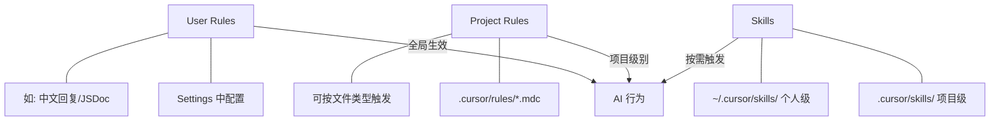

# Cursor 智能化使用指南与项目优化方案

## 一、当前状况分析

你的项目目前只有 `.cursorignore` 和 User Rules（JSDoc、console 标识、中文回复），**没有利用 Cursor 最强大的两个特性**：

- **Cursor Rules**（`.cursor/rules/*.mdc`）— 项目级别的 AI 指令，让 Cursor 自动理解并遵循你的项目规范
- **Cursor Skills**（`.cursor/skills/` 或 `~/.cursor/skills/`）— 可复用的工作流技能

你的 `docs/` 目录里有非常详细的代码规范（`代码规范.md`、`项目概览.md` 等），但 **Cursor 不会自动阅读这些文档**，除非你通过 Rules 或 @ 引用告诉它。

---

## 二、核心概念：Cursor 的三层配置体系

- **User Rules**（你已有）：全局生效，适合个人偏好（语言、风格）
- **Project Rules**（你需要创建）：项目级别，适合代码规范、架构约束、技术选型
- **Skills**（可选进阶）：复杂工作流的封装，如"创建新页面"、"添加 API 接口"

---

## 三、推荐创建的 Cursor Rules

### Rule 1：项目全局规则（alwaysApply）

文件：`.cursor/rules/project-global.mdc`

将 `docs/项目概览.md` 和 `docs/代码规范.md` 中的关键信息提炼为简洁规则：

- 技术栈声明（React 19 + Vite 7 + TS + Antd 6 + Zustand + UnoCSS + Cesium）
- 路径别名 `@/*` 映射到 `src/*`
- 状态管理用 Zustand，UI 用 Antd 6，样式用 UnoCSS
- 文件命名和目录结构约定
- JSDoc 注释规范（结合你已有的 User Rule）
- console 调试标识规范

### Rule 2：React/TSX 组件规则（文件匹配）

文件：`.cursor/rules/react-component.mdc`，`globs: **/*.tsx`

- 使用函数式组件 + Hooks
- 复用逻辑抽取到 `hooks/` 目录
- 页面组件放在 `pages/` + 每个页面一个目录
- 组件 props 需要定义 TypeScript interface
- 使用 Antd 6 组件，不要引入其他 UI 库

### Rule 3：Cesium 相关规则

文件：`.cursor/rules/cesium-rules.mdc`，`globs: src/cesium/**,src/cesiumApp/**,src/pages/cesium-view/**`

- 使用项目封装的 `CesiumViewer` 和 `useCesium` Hook
- Cesium 配置通过 `cesium/config.ts` 管理
- 引用 Cesium 资源的约定

### Rule 4：API/Services 规则

文件：`.cursor/rules/api-services.mdc`，`globs: src/services/**`

- 使用 Axios 封装的请求方法
- 统一错误处理方式
- 接口类型定义规范

---

## 四、Cursor 使用技巧（高效实践）

### 技巧 1：善用 @ 引用上下文

| 用法              | 说明            |
| --------------- | ------------- |
| `@文件路径`         | 引用具体文件作为上下文   |
| `@目录/`          | 引用整个目录        |
| `@docs/代码规范.md` | 让 AI 阅读你的规范文档 |
| `@Web`          | 让 AI 搜索最新文档   |
| `@Git`          | 引用 Git 历史     |
| `@Codebase`     | 搜索整个代码库       |

**实战例子**：当你要创建一个新页面时，输入：

> "参考 @src/pages/home/ 的结构，创建一个新的用户管理页面"

### 技巧 2：使用 Composer（Agent 模式）进行多文件操作

- 按 `Cmd+I` 打开 Composer
- Agent 模式可以自动创建/修改多个文件、运行命令
- 适合"创建新功能模块"、"重构"等跨文件任务

### 技巧 3：用 Notepads 存储常用提示词

- 在 `.cursor/` 目录下创建 Notepads
- 存储常用的 prompt 模板，如"创建新页面模板"、"添加 API 接口模板"

### 技巧 4：渐进式提问

不要一次给出过于复杂的需求，分步骤来：

1. 先让 AI 理解现有代码结构
2. 再描述要做的功能
3. 最后逐步实现和调整

### 技巧 5：Plan 模式先规划再执行

- 对于复杂任务，先用 Plan 模式让 AI 生成方案
- 确认方案后再切换到 Normal/Agent 模式执行
- 这样可以避免 AI "跑偏"

### 技巧 6：利用 .cursorrules 或 Rules 传递隐性知识

把团队的"潜规则"写成 Rules，比如：

- "所有 API 请求都要经过 `src/services/request.ts` 的封装"
- "新建页面必须在 `routes/config.tsx` 中注册路由"
- "主题变量定义在 `styles/variables.css` 中"

---

## 五、实施步骤

按优先级排序，建议先做 Rule 1 和 Rule 2，立即提升代码生成质量。
