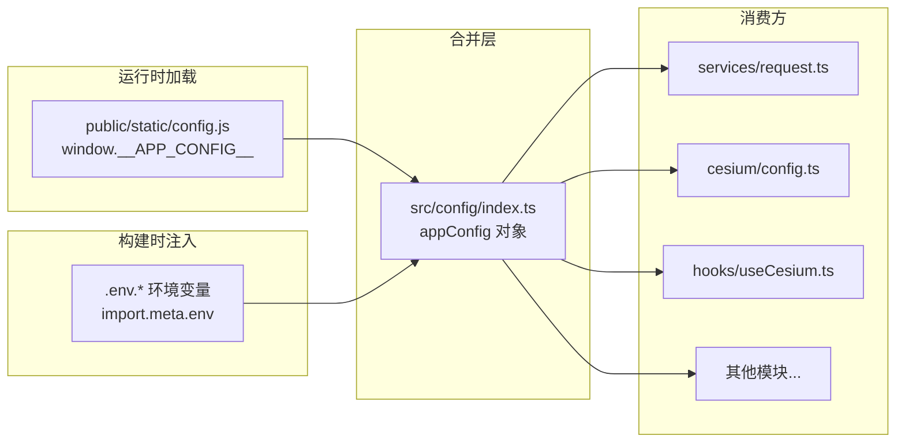

# 内网环境 config.js 用户自定义配置

## 现状分析

- 当前所有配置项通过 Vite 环境变量（`.env.*`）管理，构建后写死在产物中无法修改
- `public/static/config.js` 已存在但为空，`index.html` 未引入该脚本
- 使用 `import.meta.env` 的位置共 3 处：
  - [src/services/request.ts](src/services/request.ts) 第 15 行 - `VITE_APP_BASE_API`
  - [src/cesium/config.ts](src/cesium/config.ts) 第 30 行 - `VITE_CESIUM_ACCESS_TOKEN`
  - [src/hooks/useCesium.ts](src/hooks/useCesium.ts) 第 48 行 - `VITE_CESIUM_ACCESS_TOKEN`

## 整体架构




**合并优先级：**

- 生产环境：config.js > 环境变量（客户可在部署后修改 config.js 覆盖）
- 开发环境：环境变量 > config.js（开发者优先使用 .env 文件）

## 实施步骤

### 1. 填充 `public/static/config.js`

在 `window.__APP_CONFIG__` 上挂载配置对象，客户部署后可直接编辑此文件：

```javascript
window.__APP_CONFIG__ = {
  // 后端 API 地址
  baseApi: undefined,
  // 系统名称
  systemName: undefined,
  // Cesium 配置
  cesium: {
    // Cesium Ion 访问令牌
    accessToken: undefined,
    // 自定义影像服务地址（如天地图、ArcGIS Server 等）
    imageryUrl: undefined,
  },
}
```

所有值默认 `undefined`，表示使用环境变量的值。客户按需填写即可覆盖。

### 2. `index.html` 引入 config.js

在 `<body>` 内、`<script type="module">` 之前加入：

```html
<script src="/static/config.js"></script>
```

确保 config.js 在应用入口之前加载完毕。

### 3. 创建 `src/config/index.ts` 配置合并模块

该模块是核心，负责：

- 定义 `AppConfig` 接口（带完整 JSDoc 注释）
- 在 `window` 上扩展 `__APP_CONFIG__` 类型声明
- 根据当前环境实现合并策略（`import.meta.env.DEV` 判断）
- 导出带类型提示的 `appConfig` 单例

关键类型定义：

```typescript
interface AppConfig {
  /** 后端 API 基础地址 */
  baseApi: string
  /** 系统名称 */
  systemName: string
  /** Cesium 相关配置 */
  cesium: {
    /** Cesium Ion 访问令牌 */
    accessToken: string
    /** 自定义影像服务地址 */
    imageryUrl: string
  }
}
```

合并逻辑伪代码：

```typescript
function resolveValue(runtimeVal, envVal, fallback) {
  if (import.meta.env.DEV) {
    return envVal || runtimeVal || fallback
  }
  return runtimeVal || envVal || fallback
}
```

### 4. 替换所有 `import.meta.env` 引用

将散落在各处的直接环境变量读取改为使用 `appConfig`：

- **[src/services/request.ts](src/services/request.ts)** 第 15 行：
`import.meta.env.VITE_APP_BASE_API` -> `appConfig.baseApi`
- **[src/cesium/config.ts](src/cesium/config.ts)** 第 30 行：
`import.meta.env.VITE_CESIUM_ACCESS_TOKEN` -> `appConfig.cesium.accessToken`
- **[src/hooks/useCesium.ts](src/hooks/useCesium.ts)** 第 48 行：
`import.meta.env.VITE_CESIUM_ACCESS_TOKEN` -> `appConfig.cesium.accessToken`

### 5. 更新 `index.html` 的 title

将硬编码的 `<title>react-template</title>` 保留，但在 `src/main.tsx` 或 `src/App.tsx` 入口处动态设置：

```typescript
document.title = appConfig.systemName
```

## 文件变更清单


| 文件                        | 操作                                   |
| ------------------------- | ------------------------------------ |
| `public/static/config.js` | 填充配置模板                               |
| `index.html`              | 添加 config.js script 标签               |
| `src/config/index.ts`     | 新建 - 配置合并模块                          |
| `src/services/request.ts` | 修改 - 使用 appConfig.baseApi            |
| `src/cesium/config.ts`    | 修改 - 使用 appConfig.cesium.accessToken |
| `src/hooks/useCesium.ts`  | 修改 - 使用 appConfig.cesium.accessToken |
| `src/main.tsx`            | 修改 - 动态设置 document.title             |


