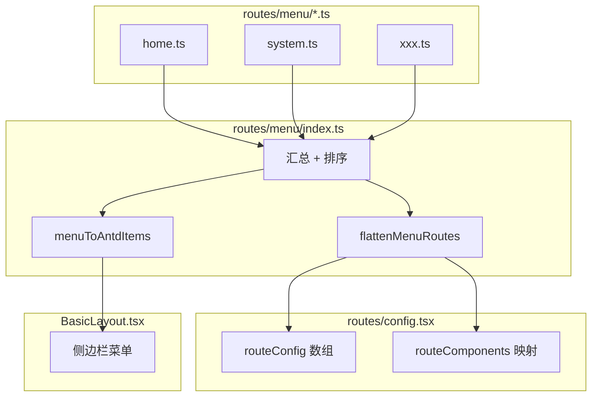
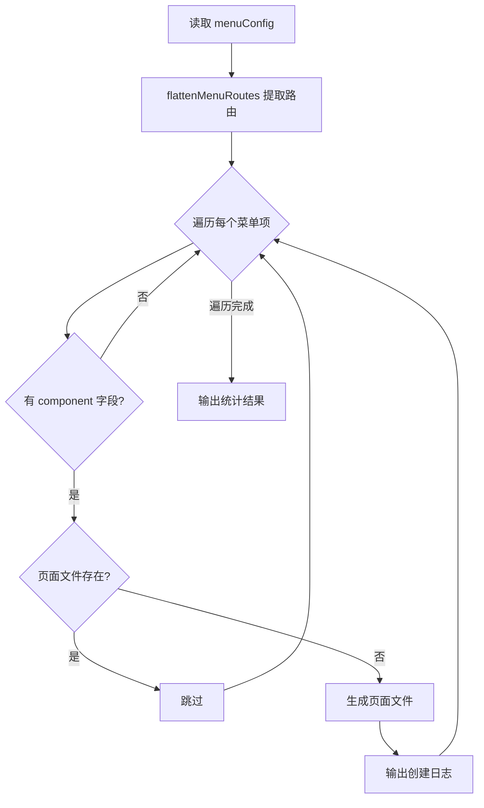

# 菜单路由统一管理方案

## 设计目标

- 菜单配置与路由配置合二为一
- 支持多级嵌套菜单（父级菜单可无页面）
- 支持排序、权限、图标等扩展字段
- 模块化拆分，便于大型项目维护

## 目录结构

```
src/routes/
├── menu/                    # 菜单配置目录
│   ├── index.ts             # 汇总导出所有菜单
│   ├── types.ts             # 菜单类型定义
│   ├── home.ts              # 首页相关菜单
│   ├── system.ts            # 系统管理菜单
│   └── xxx.ts               # 其他模块菜单
├── config.tsx               # 路由配置（从 menu 生成）
├── index.tsx                # 路由主入口
└── ProtectedRoute.tsx       # 路由守卫
```

## 核心类型定义

`[src/routes/menu/types.ts](src/routes/menu/types.ts)` - 新建

```typescript
/**
 * 菜单路由配置接口
 */
export interface MenuItem {
  /** 唯一标识（用于 key） */
  id: string
  /** 路由路径，父级菜单可不填 */
  path?: string
  /** 菜单标题 */
  title: string
  /** 图标名称（使用 Ant Design 图标） */
  icon?: string
  /** 排序权重，数字越小越靠前 */
  order?: number
  /** 子菜单 */
  children?: MenuItem[]
  /** 是否在菜单中隐藏 */
  hideInMenu?: boolean
  /** 是否需要登录 */
  requiresAuth?: boolean
  /** 权限标识列表 */
  permissions?: string[]
  /** 重定向路径 */
  redirect?: string
  /** 是否为外链 */
  external?: boolean
  /** 外链地址 */
  externalUrl?: string
  /** 打开方式 _blank | _self */
  target?: '_blank' | '_self'
  /** 组件路径（用于懒加载） */
  component?: string
  /** 是否缓存页面（配合 keep-alive） */
  keepAlive?: boolean
  /** 扩展字段 */
  [key: string]: unknown
}
```

## 菜单配置示例

`[src/routes/menu/home.ts](src/routes/menu/home.ts)` - 新建

```typescript
import type { MenuItem } from './types'

export const homeMenu: MenuItem[] = [
  {
    id: 'home',
    path: '/home',
    title: '首页',
    icon: 'HomeOutlined',
    order: 1,
    component: '@/pages/home',
  },
]
```

`[src/routes/menu/system.ts](src/routes/menu/system.ts)` - 新建（展示多级菜单）

```typescript
import type { MenuItem } from './types'

export const systemMenu: MenuItem[] = [
  {
    id: 'system',
    title: '系统管理',
    icon: 'SettingOutlined',
    order: 100,
    // 无 path，作为父级菜单
    children: [
      {
        id: 'system-user',
        path: '/system/user',
        title: '用户管理',
        icon: 'UserOutlined',
        order: 1,
        component: '@/pages/system/user',
        requiresAuth: true,
      },
      {
        id: 'system-role',
        path: '/system/role',
        title: '角色管理',
        icon: 'TeamOutlined',
        order: 2,
        component: '@/pages/system/role',
        requiresAuth: true,
      },
    ],
  },
]
```

## 菜单汇总与工具函数

`[src/routes/menu/index.ts](src/routes/menu/index.ts)` - 新建

```typescript
import { homeMenu } from './home'
import { systemMenu } from './system'
import type { MenuItem } from './types'

// 汇总所有菜单
export const menuConfig: MenuItem[] = [
  ...homeMenu,
  ...systemMenu,
].sort((a, b) => (a.order ?? 999) - (b.order ?? 999))

// 递归排序子菜单
export function sortMenuItems(items: MenuItem[]): MenuItem[]

// 扁平化菜单（提取所有有路由的项）
export function flattenMenuRoutes(items: MenuItem[]): MenuItem[]

// 菜单转 Antd Menu 格式
export function menuToAntdItems(items: MenuItem[]): MenuProps['items']
```

## 路由配置改造

`[src/routes/config.tsx](src/routes/config.tsx)` - 修改

- 从 `menu/index.ts` 读取菜单配置
- 使用 `flattenMenuRoutes()` 提取所有路由
- 动态生成 `routeComponents` 映射

## 布局组件改造

`[src/layouts/BasicLayout.tsx](src/layouts/BasicLayout.tsx)` - 修改

- 使用 `menuToAntdItems()` 生成多级菜单
- 支持父级菜单展开/收起（SubMenu）

## 数据流向图




## 关键改动文件


| 文件                            | 操作   | 说明                |
| ----------------------------- | ---- | ----------------- |
| `src/routes/menu/types.ts`    | 新建   | 菜单类型定义            |
| `src/routes/menu/index.ts`    | 新建   | 菜单汇总与工具函数         |
| `src/routes/menu/home.ts`     | 新建   | 首页菜单配置            |
| `src/routes/menu/system.ts`   | 新建   | 系统管理菜单示例          |
| `src/routes/config.tsx`       | 修改   | 从 menu 生成路由配置     |
| `src/layouts/BasicLayout.tsx` | 修改   | 支持多级菜单渲染          |
| `src/types/global.d.ts`       | 可选修改 | 同步更新 RouteMeta 类型 |


## 扩展性设计

- **新增菜单模块**：在 `routes/menu/` 下新建 `.ts` 文件，导入到 `index.ts`
- **权限过滤**：在 `menuToAntdItems()` 中根据用户权限过滤菜单
- **动态菜单**：后端返回菜单数据时，只需符合 `MenuItem` 接口即可

---

## 页面自动生成脚本

### 目录结构

```
scripts/
└── generate-pages.ts    # 页面生成脚本
```

### 脚本功能

`[scripts/generate-pages.ts](scripts/generate-pages.ts)` - 新建

读取菜单配置，自动生成缺失的页面文件：

```typescript
/**
 * 页面自动生成脚本
 * 根据菜单配置自动创建缺失的页面文件
 * 
 * 使用方式：npm run gen:pages
 */

import fs from 'fs'
import path from 'path'
import { menuConfig, flattenMenuRoutes } from '../src/routes/menu'
import type { MenuItem } from '../src/routes/menu/types'

// 页面模板（生成 JSX 文件）
const PAGE_TEMPLATE = (title: string, pageName: string) => `/**
 * ${title}
 * 页面功能描述
 */

/**
 * ${title}页面组件
 * @returns React 组件
 */
const ${pageName} = () => {
  return (
    <div className="fade-in p-4">
      <h1 className="text-2xl font-bold mb-4">${title}</h1>
      <p className="text-secondary">页面内容待开发...</p>
    </div>
  )
}

export default ${pageName}
`

/**
 * 根据路径生成组件名
 * @param path 路由路径，如 /system/user
 * @returns PascalCase 组件名，如 SystemUserPage
 */
function pathToComponentName(path: string): string

/**
 * 根据 component 字段解析页面目录
 * @param component 组件路径，如 @/pages/system/user
 * @returns 实际文件路径，如 src/pages/system/user
 */
function resolvePageDir(component: string): string

/**
 * 检查页面文件是否存在
 * @param pageDir 页面目录路径
 * @returns 是否存在
 */
function pageExists(pageDir: string): boolean

/**
 * 创建页面文件
 * @param pageDir 页面目录
 * @param title 页面标题
 * @param componentName 组件名称
 */
function createPage(pageDir: string, title: string, componentName: string): void

/**
 * 主函数：扫描菜单并生成缺失页面
 */
function main(): void
```

### 脚本执行流程




### 使用方式

在 `package.json` 中添加脚本命令：

```json
{
  "scripts": {
    "gen:pages": "npx tsx scripts/generate-pages.ts"
  }
}
```

运行命令：

```bash
npm run gen:pages
```

### 输出示例

```
[generate-pages] 开始扫描菜单配置...
[generate-pages] 找到 8 个需要页面的菜单项
[generate-pages] ✓ 创建页面: src/pages/system/user/index.jsx
[generate-pages] ✓ 创建页面: src/pages/system/role/index.jsx
[generate-pages] - 跳过已存在: src/pages/home/index.jsx
[generate-pages] 完成！新建 2 个页面，跳过 6 个已存在页面
```

### 脚本特性

- **增量生成**：只创建不存在的页面，不覆盖现有文件
- **自动创建目录**：递归创建多级目录结构
- **标准模板**：生成符合项目规范的页面组件
- **日志输出**：清晰显示创建/跳过的文件
- **支持嵌套**：正确处理多级路由如 `/system/user`
- **JSX 格式**：默认生成 `.jsx` 文件，不使用 TypeScript 类型注解
- **智能检测**：同时检测 `.jsx` 和 `.tsx` 文件是否存在，避免重复创建

### 关键改动文件（脚本部分）


| 文件                          | 操作  | 说明                |
| --------------------------- | --- | ----------------- |
| `scripts/generate-pages.ts` | 新建  | 页面自动生成脚本          |
| `package.json`              | 修改  | 添加 `gen:pages` 命令 |


